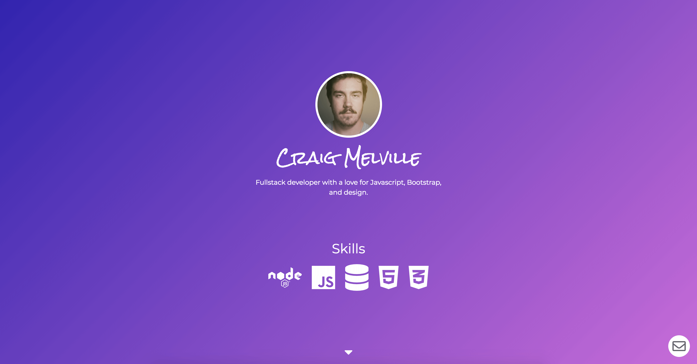

# Portfolio Project

Created a responsive portfolio website utilizing Bootstrap.

[Live Website](https://acekreations.github.io/Portfolio/)

## Technology Used
- HTML
- CSS
- Bootstrap 4
- animate.css

## Learning Points
- Learned how to implement and use Bootstrap
- Learned how to use many of the Bootstrap components
- Learned how to use Bootstrap to make a responsive website

## Author
Craig Melville
